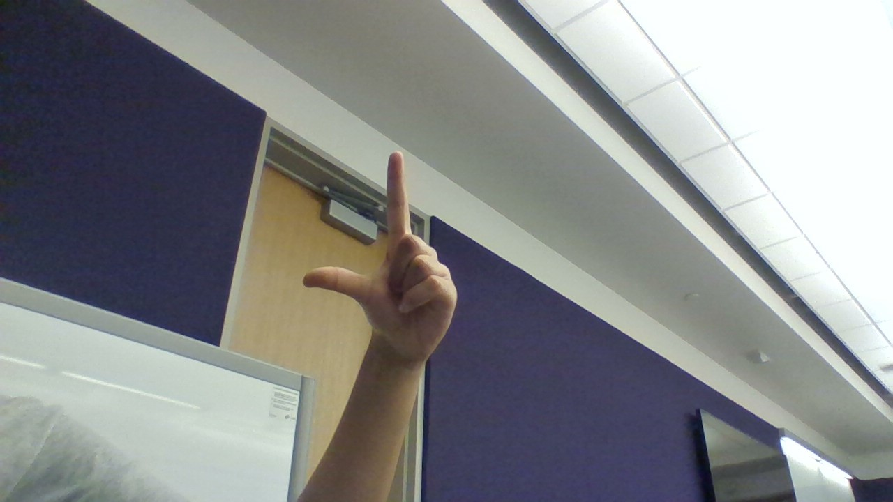
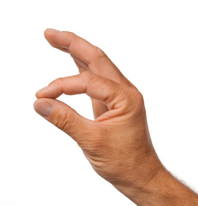
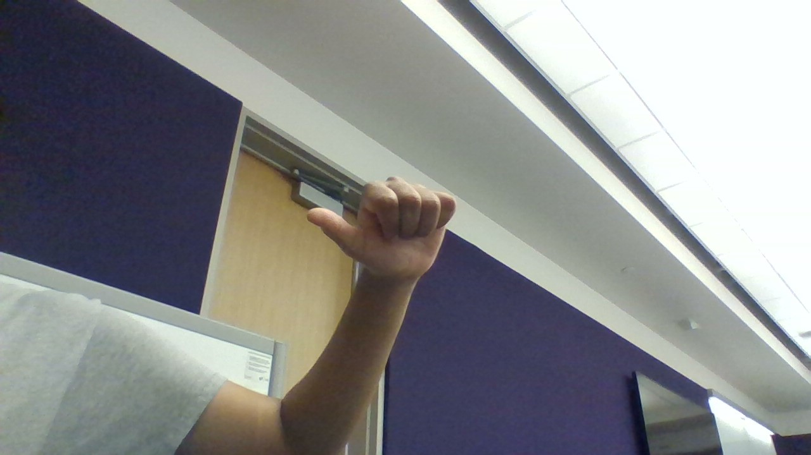
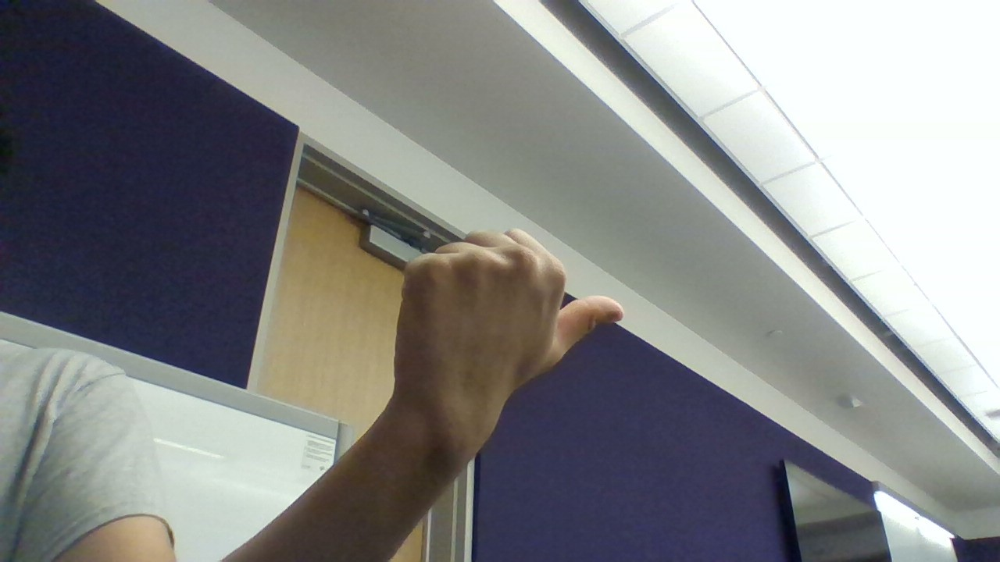

# Banana Blindness

## What is it?
Banana Blindness is a Python program that uses hand gestures and movements to control the user's laptop. It is meant for a better hands-free experience, such as when you're watching content and you do not want to touch your keyboard.

## How is it made?
The Banana Blindness program runs on Python and uses OpenCV and Tensorflow to detect the user's hand with AI and decipher hand gestures. Our website runs on Next.JS and is styled with Tailwind CSS.

## Available Hand Gestures
Here is a list of the available hand gestures:
- Move your hand in an L shape (with only your index finger and thumb) to move your cursor on the screen (Picture 1) 
- Tap your index finger and thumb for left click (Picture 2) 
- Fold your hand into a thumbs-up and turn it left 90 degrees (like the image below) to rewind video by 5 seconds (Picture 4) 
- Fold your hand into a thumbs-up and turn it right 90 degrees (like the image below) to forward video by 5 seconds (Picture 3) 
- Tap your index finder and thumb, keep them closed, and move your hand up and down to scroll! 

| Gesture |  #1   |  #2   |  #3   |  #4   | 
| :-----: | :---: | :---: | :---: | :---: |
| Seconds |    |    |    |    |

# Links
[Devpost](#) 
[Website](#)